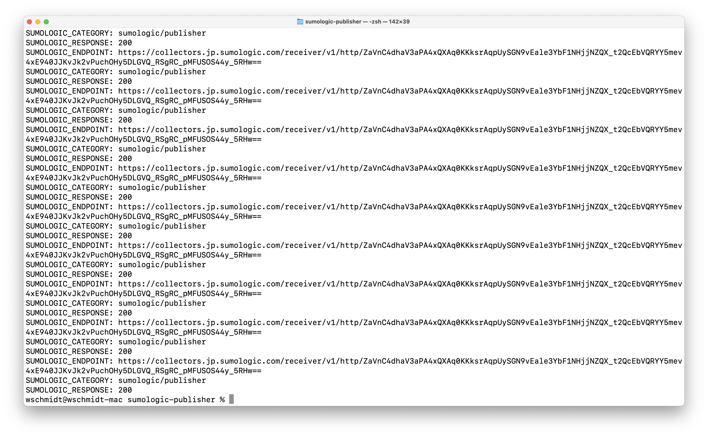
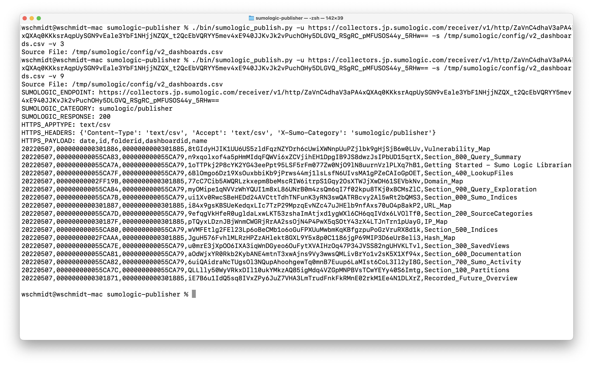

Sumo Logic Publish Platform
===========================

Ever wanted to have a tool to publish anything to Sumo Logic source category? Here we go.

Armed with this, you can combine your DevOps and Development practices to publish logs, documents, configuration files.

Features
========

The script supports the ability to choose:

* the sourceCategory

* the sourceURL

Business Case
=============

Curious what was the business goals we wanted to solve? 

Please read on in our [writeup](doc/writeup.md)!

Examples
========

Installing the Scripts
=======================

The scripts are command line based, designed to be used within a batch script or DevOPs tool such as Chef or Ansible.
Each script is a python3 script, and the complete list of the python modules will be provided to aid people using a pip install.

You will need to use Python 3.6 or higher and the modules listed in the dependency section.  

The steps are as follows: 

    1. Download and install python 3.6 or higher from python.org. Append python3 to the LIB and PATH env.

    2. Download and install git for your platform if you don't already have it installed.
       It can be downloaded from https://git-scm.com/downloads
    
    3. Open a new shell/command prompt. It must be new since only a new shell will include the new python 
       path that was created in step 1. Cd to the folder where you want to install the scripts.
    
    4. Execute the following command to install pipenv, which will manage all of the library dependencies:
    
        sudo -H pip3 install pipenv 
 
    5. Clone this repository. This will create a new folder
    
    6. Change into this folder. Type the following to install all the package dependencies 
       (this may take a while as this will download all of the libraries it uses):

        pipenv install
        
Dependencies
============

See the contents of "pipfile"

Script Names and Purposes
=========================

The scripts are organized into sub directories:

    1. ./bin - 
       bin/mimemap.py - provides a mapping of data sources to mime types
       bin/sumologic_publish.py - publish data via a source on a hosted collector

To Do List:
===========

* extend to other languages

License
=======

Copyright 2019-2022 Wayne Kirk Schmidt
https://www.linkedin.com/in/waynekirkschmidt

Licensed under the Apache 2.0 License (the "License");

You may not use this file except in compliance with the License.
You may obtain a copy of the License at

    license-name   APACHE 2.0
    license-url    http://www.apache.org/licenses/LICENSE-2.0

Unless required by applicable law or agreed to in writing, software
distributed under the License is distributed on an "AS IS" BASIS,
WITHOUT WARRANTIES OR CONDITIONS OF ANY KIND, either express or implied.
See the License for the specific language governing permissions and
limitations under the License.

Support
=======

Feel free to e-mail me with issues to: 

* wschmidt@sumologic.com

* wayne.kirk.schmidt@gmail.com

I will provide "best effort" fixes and extend the scripts.
